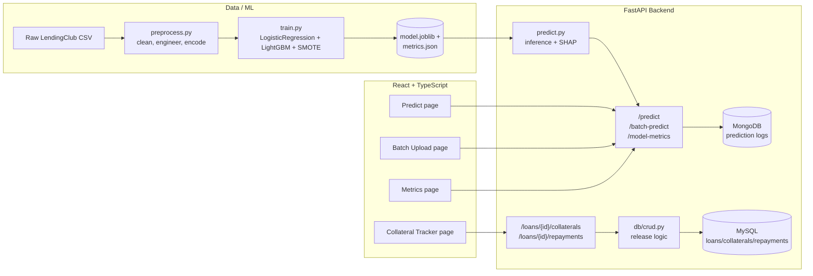

# LendingClub Credit Risk Prediction System

A full-stack credit risk scoring application trained on real LendingClub loan
data: predicts probability of default, explains *why* via SHAP, supports
single and batch scoring, and includes a secured-lending collateral/repayment
ledger with automatic partial-release tracking.

Built as a portfolio project demonstrating applied ML (imbalanced
classification, gradient boosting, explainability) alongside full-stack
engineering (FastAPI, React/TypeScript, MongoDB + MySQL, deployment).

**Live demo:** [lendingclub-credit-risk.vercel.app](https://lendingclub-credit-risk.vercel.app)
**API docs:** [lendingclub-credit-risk-api.onrender.com/docs](https://lendingclub-credit-risk-api.onrender.com/docs)

*(Backend is on Render's free tier — the first request after a period of inactivity can take ~50s to wake up.)*

---

## Features

- **Single-applicant prediction** — enter loan/applicant details, get a default probability, risk tier (Low/Medium/High), and the top 5 SHAP factors driving the score
- **Batch scoring** — drag-and-drop a CSV of applicants, get a sortable/filterable results table with CSV export
- **Model metrics dashboard** — AUC-ROC, ROC curve, confusion matrix, precision/recall for both the baseline and primary model
- **Secured-loan collateral tracking** — pledge one or more collaterals per loan, each with its own cumulative-repayment release target; recording a repayment re-evaluates every collateral and flips qualifying ones to `Released` (one-directional, with an in-app notification when something newly qualifies)

---

## Architecture



---

## Tech Stack

| Layer | Tools |
|---|---|
| Data / Modeling | pandas, NumPy, scikit-learn, LightGBM, imbalanced-learn (SMOTE), SHAP, joblib |
| Backend | FastAPI, Pydantic, SQLAlchemy, PyMongo, PyMySQL |
| Databases | MongoDB (prediction logs), MySQL (loans/collaterals/repayments ledger) |
| Frontend | React + TypeScript, Vite, Tailwind CSS, Recharts, react-dropzone, Axios |
| Deployment | Render (backend), Vercel (frontend) |

Full rationale in [Tech_Stack_LendingClub_Credit_Risk.md](Tech_Stack_LendingClub_Credit_Risk.md).

---

## Model Performance

Trained on ~1.35M fully-resolved LendingClub loans (`Fully Paid` / `Charged
Off`), 171 engineered features, evaluated on a held-out 20% test set
(untouched by SMOTE — training only).

| Model | AUC-ROC | Precision | Recall | F1 |
|---|---|---|---|---|
| Logistic Regression (baseline) | 0.7204 | 0.5669 | 0.0801 | 0.1404 |
| **LightGBM (primary)** | **0.7344** | 0.5832 | 0.1063 | 0.1798 |

AUC-ROC of 0.7344 clears the ≥0.70 target and sits within LendingClub credit
models' typical 0.68–0.75 range. Precision/recall above are at a naive 0.5
cutoff; the product itself buckets by probability into Low/Medium/High risk
tiers (see `backend/predict.py`), not a hard classification threshold.

Top SHAP-ranked risk drivers: loan `term`, `int_rate`, `verification_status`,
`home_ownership`, `inq_last_6mths` — consistent with real-world credit risk
intuition.

Full metrics (including ROC curve points and confusion matrix) are served
live at `GET /model-metrics` and rendered on the frontend's Metrics page.

Collateral release logic is verified against the PRD's required test cases
(partial payment, exact-target payment, overpayment) in
[`backend/db/test_release_logic.py`](backend/db/test_release_logic.py).

---

## Repo Structure

```
lendingclub-credit-risk/
├── data/
│   ├── raw/                  # LendingClub CSV (gitignored, ~1.6GB)
│   └── processed/            # cleaned/engineered parquet (gitignored, regenerated by train.py)
├── notebooks/
│   └── eda_and_modeling.ipynb
├── model/
│   ├── train.py               # training pipeline (run from repo root)
│   ├── preprocess.py           # shared cleaning/feature engineering (used by train + API)
│   ├── model.joblib            # trained LightGBM + preprocessing artifacts (committed)
│   └── metrics.json            # evaluation metrics (committed)
├── backend/
│   ├── main.py                 # FastAPI app + routes
│   ├── schemas.py               # Pydantic request/response models
│   ├── predict.py               # loads model, runs inference + SHAP
│   ├── mongo.py                 # prediction logging
│   ├── db/
│   │   ├── models.py             # SQLAlchemy: Loan, Collateral, Repayment
│   │   ├── session.py            # MySQL connection/session
│   │   ├── crud.py               # queries + release-check logic
│   │   └── test_release_logic.py # release logic test cases
│   ├── routers/
│   │   └── collateral.py         # /loans/{id}/collaterals, /loans/{id}/repayments
│   └── requirements.txt
├── frontend/
│   ├── src/
│   │   ├── pages/ (Predict, BatchUpload, Metrics, CollateralTracker)
│   │   ├── components/ (CollateralProgressBar, RepaymentForm, StatusBadge, NavBar)
│   │   └── api/client.ts
│   └── package.json
├── render.yaml
└── README.md
```

---

## Local Setup

### Prerequisites
- Python 3.9+, Node 18+
- MongoDB and MySQL running locally (or point at cloud instances via env vars)

### 1. Data & Model
```bash
python3 -m venv venv
source venv/bin/activate
pip install -r model/requirements.txt

# Place the LendingClub "accepted_2007_to_2018Q4.csv" file in data/raw/,
# then train (regenerates model/model.joblib and model/metrics.json):
python3 model/train.py
```

> **macOS note:** LightGBM needs the OpenMP runtime: `brew install libomp`.

### 2. Backend
```bash
cd backend
pip install -r requirements.txt

# Env vars (optional — default to local instances):
export MONGO_URI="mongodb://localhost:27017/"
export DATABASE_URL="mysql+pymysql://root@localhost/lendingclub_credit_risk"

uvicorn main:app --port 8000
```
Visit `http://localhost:8000/docs` for interactive API docs.

To set up the MySQL schema on first run:
```bash
python3 -c "from db.session import engine; from db.models import Base; Base.metadata.create_all(bind=engine)"
```

### 3. Frontend
```bash
cd frontend
npm install
npm run dev
```
Visit `http://localhost:5173`.

---

## API Reference

| Method | Path | Description |
|---|---|---|
| GET | `/health` | Health check |
| POST | `/predict` | Single applicant → probability, risk tier, top SHAP factors |
| POST | `/batch-predict` | CSV upload → scored results (JSON) |
| GET | `/model-metrics` | AUC-ROC, ROC curve, confusion matrix, precision/recall |
| GET | `/loans/{loan_id}/collaterals` | Collateral statuses + remaining amount to release |
| POST | `/loans/{loan_id}/repayments` | Record a repayment, returns updated collateral statuses |

Full request/response schemas: `http://localhost:8000/docs`.

---

## Deployment

`render.yaml` is set up for a one-click Render Blueprint deploy of the
backend (root dir `backend/`, reads `MONGO_URI`, `DATABASE_URL`,
`FRONTEND_ORIGIN` from the Render dashboard). The frontend deploys to Vercel
with root directory set to `frontend/` and `VITE_API_BASE_URL` pointing at
the Render URL. `frontend/vercel.json` rewrites all paths to `index.html` so
client-side routes (`/metrics`, `/batch`, `/collateral`) work on direct
navigation, not just `/`.

Make sure your MongoDB Atlas IP Access List allows connections from anywhere
(`0.0.0.0/0`) — Render's outbound IPs aren't static, so restricting to a
single IP will cause `/predict` and `/batch-predict` to fail with a TLS
handshake error.

Steps:
1. Provision a MongoDB Atlas cluster and a cloud MySQL instance (e.g. PlanetScale, Railway)
2. Push this repo to GitHub
3. Render → New → Blueprint → select the repo → fill in `MONGO_URI` and `DATABASE_URL`
4. Vercel → Import the repo → Root Directory: `frontend` → set `VITE_API_BASE_URL` to the Render URL
5. Back on Render, set `FRONTEND_ORIGIN` to the Vercel URL and redeploy (CORS)

---

## Non-Goals / Known Limitations

- Not a production-grade underwriting system — no regulatory compliance certification
- Batch and on-demand scoring only, no live/streaming applications
- No authentication/multi-tenancy (single-user demo tool)

See [PRD_LendingClub_Credit_Risk_1.md](PRD_LendingClub_Credit_Risk_1.md) for
full requirements and [TODO.md](TODO.md) for the complete task breakdown.
